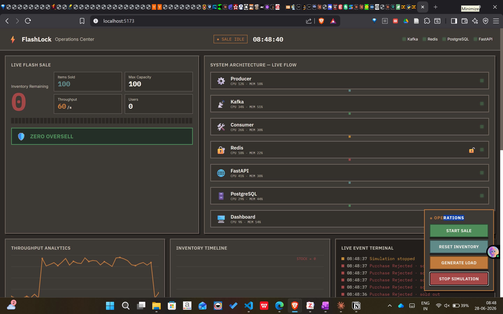
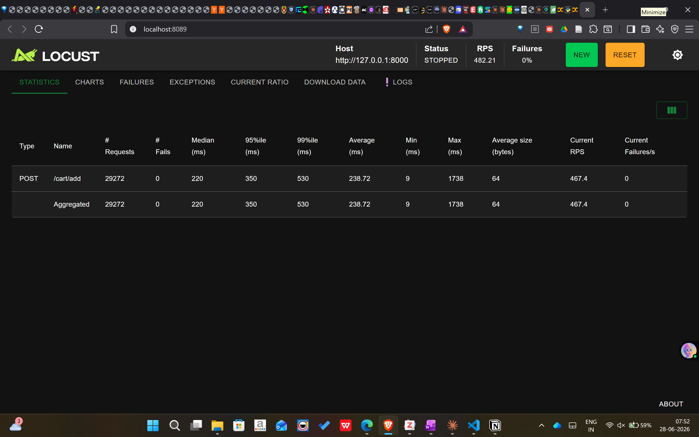

# FlashLock — Flash-Sale Inventory Engine

A distributed inventory system that guarantees **zero overselling** when thousands of
users try to buy the same product in the same instant — the classic flash-sale problem.

**Live demo:** https://flashlock.vercel.app
**Live API + docs:** https://flashlock.onrender.com/docs



> Note: the API runs on a free tier that sleeps after ~15 min idle. The first request
> after a while takes ~40s to wake the server, then it's fast. Hit the `/docs` link once
> to warm it up before using the dashboard.

---

## The problem

In a flash sale, thousands of people click "Buy" on the same item within the same second.
A naive system reads the stock, sees it's available, and decrements — but between the
*read* and the *decrement*, dozens of other requests have done the same. The result is
**overselling**: 100 units in stock, 140 orders confirmed. FlashLock is built to make that
impossible, and to prove it under load.

---

## Architecture

```
                 Purchase requests
                        │
          ┌─────────────▼─────────────┐
          │   Producer (event gen)    │
          └─────────────┬─────────────┘
                        │
                 ┌──────▼──────┐
                 │    Kafka    │   durable event buffer (3 partitions, keyed by SKU)
                 └──────┬──────┘
                        │
                 ┌──────▼──────┐
                 │  Consumer   │   atomic decrement-and-check
                 └──────┬──────┘
                        │
        ┌───────────────▼───────────────┐
        │            Redis               │   hot inventory + atomic ops (HINCRBY)
        └───────────────┬───────────────┘
                        │   (reconciliation job syncs every 30s)
        ┌───────────────▼───────────────┐
        │          PostgreSQL            │   durable ground truth + audit log
        └────────────────────────────────┘

        FastAPI  ── synchronous request path (HTTP) ──►  Redis + PostgreSQL
        React dashboard ── polls ──►  FastAPI
```

**Two paths into the system:**
- **Streaming path:** Producer → Kafka → Consumer → Redis (high-throughput ingestion)
- **Request path:** Dashboard → FastAPI → Redis + Postgres (synchronous "did I get it?" buy)

Both enforce the same guarantee. Having both is deliberate — it mirrors how real systems
separate bulk event ingestion from interactive request/response.

---

## How overselling is prevented

Redis is single-threaded and processes one command at a time. The danger isn't inside a
single command — it's in the *gap* between a separate "read stock" and "write stock". Two
requests can both read `1` before either writes, and both sell.

FlashLock collapses read-and-decrement into **one atomic operation**: `HINCRBY stock -1`
returns the new value. If the result is below zero, the request overshot — it adds `1` back
and is rejected. No lock, no gap, no oversell. This replaced an earlier explicit-lock
approach that was correct but serialized every request and collapsed throughput.

Durability is kept **off the hot path**: the API only touches Redis on each buy; a separate
reconciliation job persists state to Postgres asynchronously. This keeps request latency low.

---

## Tech stack

| Layer | Technology |
|---|---|
| Event streaming | Apache Kafka (KRaft mode, no Zookeeper) |
| Hot store / locking | Redis (atomic `HINCRBY`) |
| Durable store | PostgreSQL |
| API | FastAPI (async, connection pooling) |
| Dashboard | React + Vite |
| Load testing | Locust |
| Local orchestration | Docker Compose |
| Deployment | Render (API) · Vercel (dashboard) · Upstash (Redis) · Neon (Postgres) |

---

## Load test results

Tested locally with Locust (load generator and system on one machine):



| Metric | Result |
|---|---|
| Total requests | 29,272 |
| Failures | 0 (0%) |
| Median latency | 220 ms |
| p95 latency | 350 ms |
| p99 latency | 530 ms |
| Throughput | ~467 req/s |
| **Oversold units** | **0** |

At 1,000 concurrent users the single test machine became the bottleneck (acting as load
generator + server + containers simultaneously) — a measurement constraint, not an
application one. The clean figures above are from a sustained run at a concurrency the
local hardware could serve without queuing. **Zero oversell held at every level tested.**

---

## Running locally

Requires Docker Desktop and Python 3.11+.

```bash
# 1. Start infrastructure (Redis, Kafka, Postgres, consumer)
docker-compose up -d

# 2. Create database tables
cd db && python init_db.py && cd ..

# 3. Start the API
cd api && uvicorn main:app --reload

# 4. Start the dashboard (separate terminal)
cd dashboard && npm install && npm run dev
```

API at `http://localhost:8000/docs`, dashboard at `http://localhost:5173`.

To reproduce the load test:
```bash
cd load_test && locust -f locustfile.py --host http://127.0.0.1:8000
```

---

## Engineering notes / things solved along the way

- **Kafka dual listeners** — a host producer and an in-Docker consumer can't share one
  advertised listener. Solved with two listeners: `INTERNAL://kafka:9092` for containers,
  `EXTERNAL://localhost:29092` for the host.
- **Connection-pool exhaustion** — opening a Postgres connection per request collapsed the
  API under load. Fixed with `psycopg2` pooling and Redis connection pooling.
- **Lock-contention throughput collapse** — a coarse per-SKU lock guaranteed correctness but
  rejected ~90% of requests. Replaced with atomic Redis decrement → correctness without the
  bottleneck.
- **Port collision** — a native Windows Postgres silently shadowed the Docker one on 5432;
  diagnosed via `Get-NetTCPConnection`, fixed by mapping Docker to 5433.
- **Python 3.13 / Kafka consumer crash** — ran the consumer in a `python:3.11-slim` container
  to dodge a selector bug.

---

## Note on the live dashboard

Live inventory, oversell count, and sale controls are backed by the real API. The
throughput / latency / CPU figures shown in the dashboard are illustrative animation — the
real performance numbers come from the local Locust run above. The Kafka streaming path runs
locally via Docker Compose and is not part of the hosted demo (no free always-on managed
Kafka exists post-Upstash; hosting a broker 24/7 wasn't justified for a portfolio demo).